<div align="center">
  <h1>
    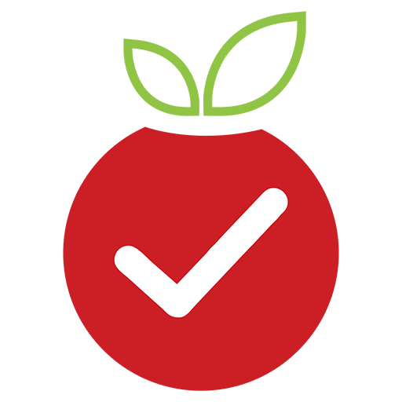<br/>
    NutriTrack - Food Diary & Nutrition Tracker
  </h1>
  <h3>A Modern App for Tracking Your Daily Meals and Nutrition</h3>
</div>

## 📸 Banner
<p align="center">
    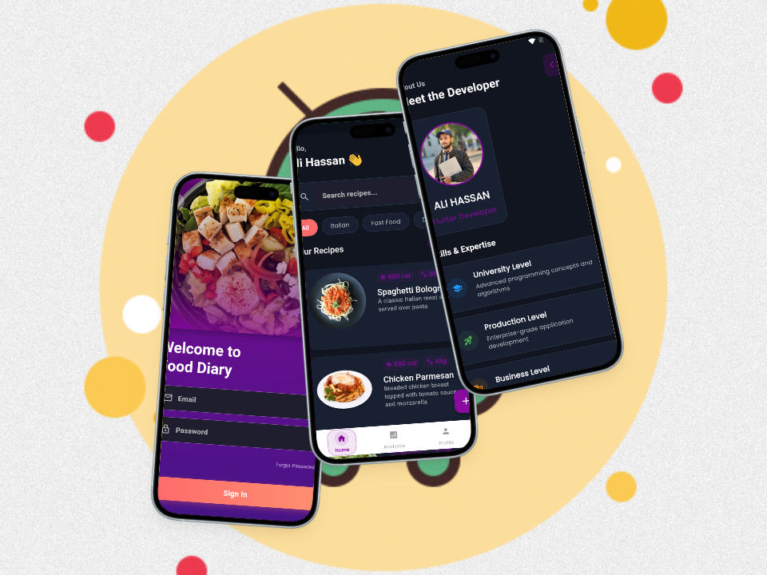
</p>

<p align="center">
    
    
    
</p>

## 📸 Screenshots

### Welcome & Onboarding

<table border="1">
  <tr>
    <td align="center">
      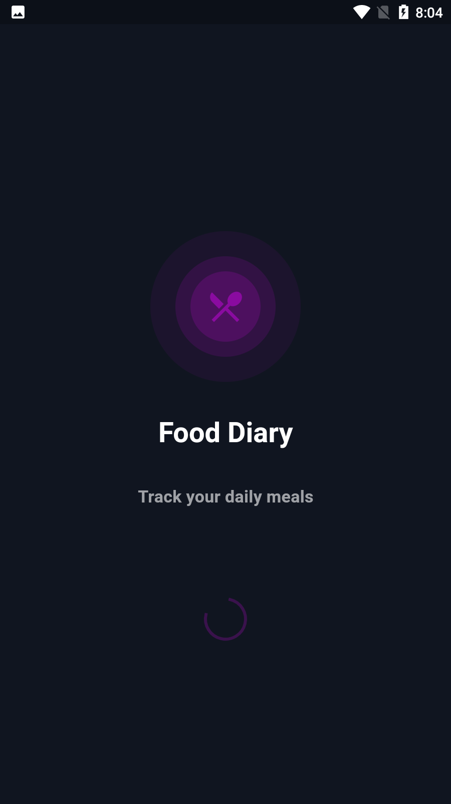
      <p><b>Splash Screen</b></p>
    </td>
    <td align="center">
      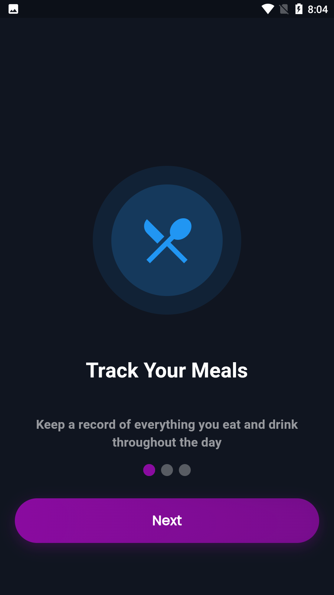
      <p><b>Walkthrough 1</b></p>
    </td>
    <td align="center">
      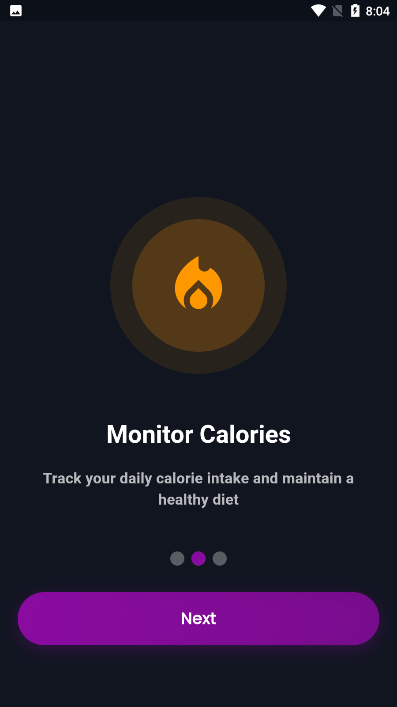
      <p><b>Walkthrough 2</b></p>
    </td>
  </tr>
  <tr>
    <td align="center">
      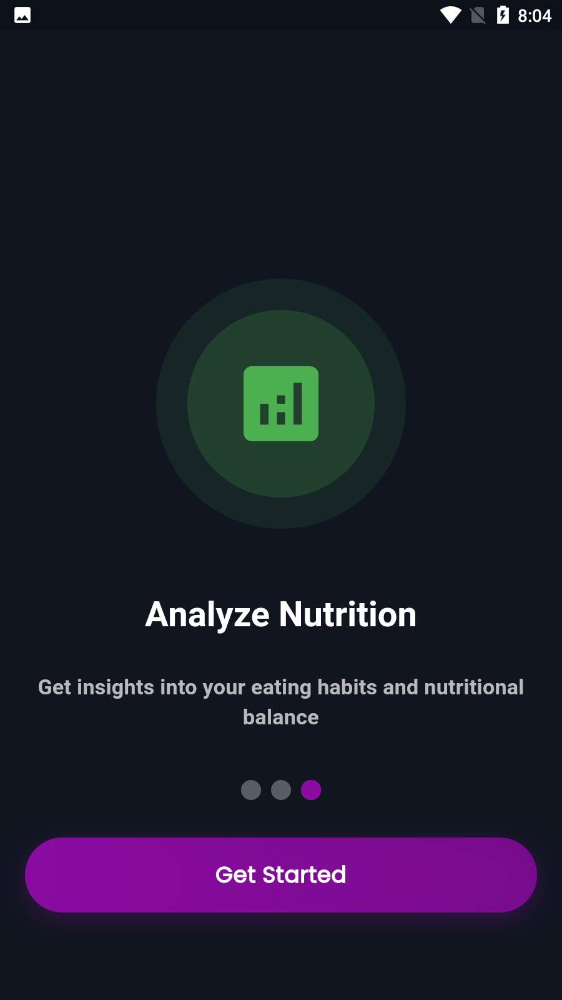
      <p><b>Walkthrough 3</b></p>
    </td>
    <td align="center">
      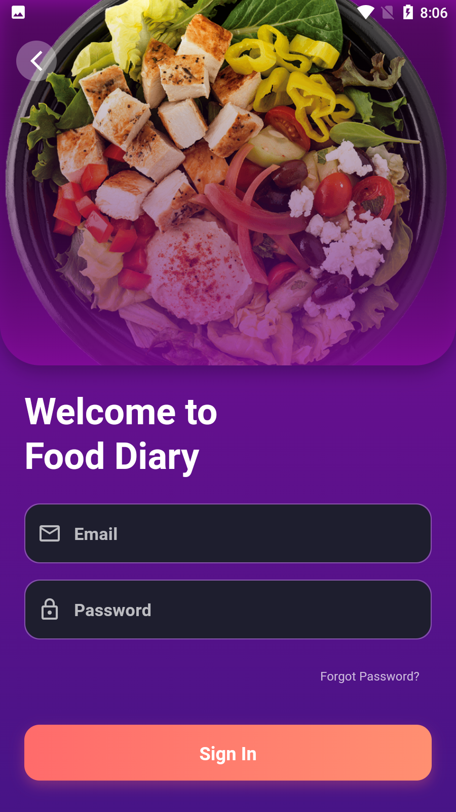
      <p><b>Login Screen</b></p>
    </td>
    <td align="center">
      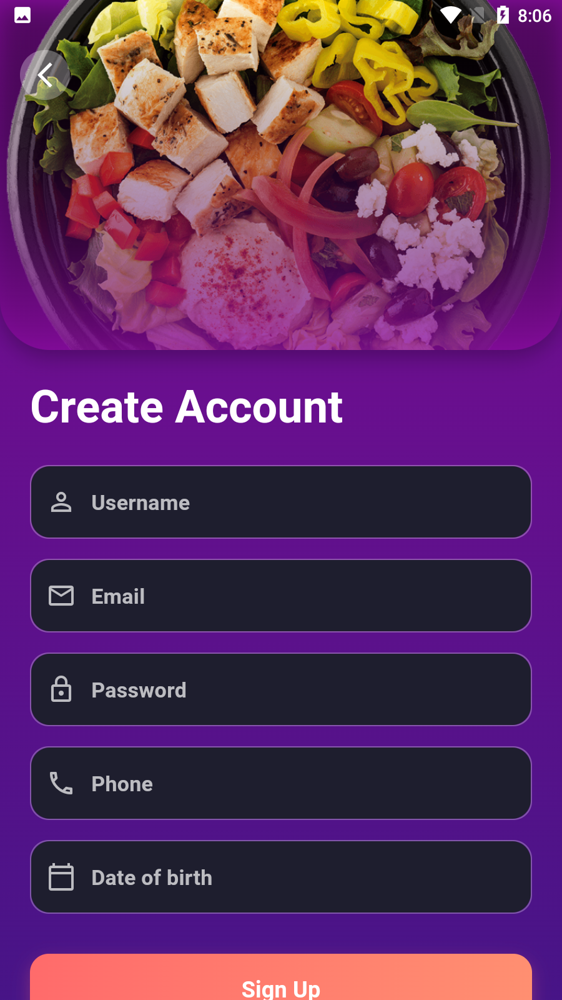
      <p><b>Create Account</b></p>
    </td>
  </tr>
</table>

### Main Features

<table border="1">
  <tr>
    <td align="center">
      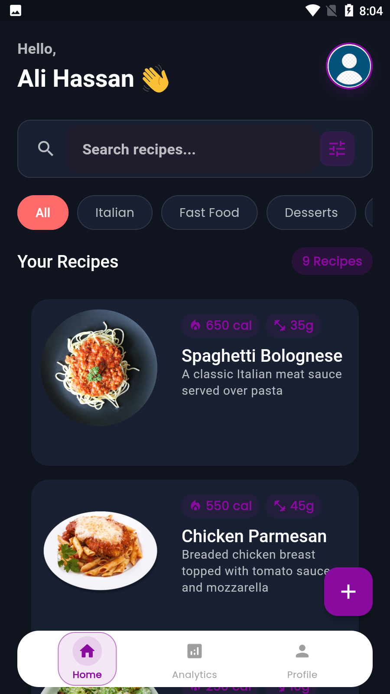
      <p><b>Home Page</b></p>
    </td>
    <td align="center">
      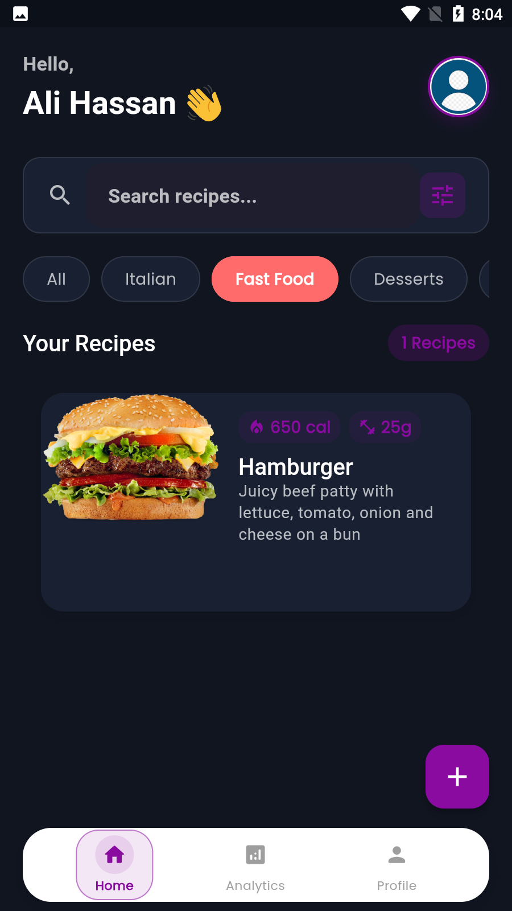
      <p><b>Filter Options</b></p>
    </td>
    <td align="center">
      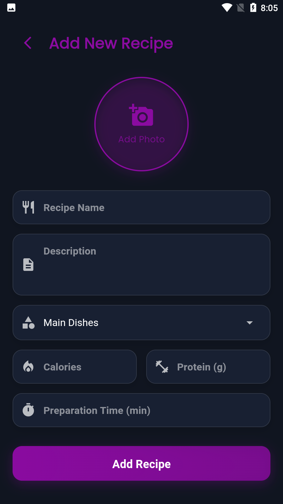
      <p><b>Add Food</b></p>
    </td>
  </tr>
  <tr>
    <td align="center">
      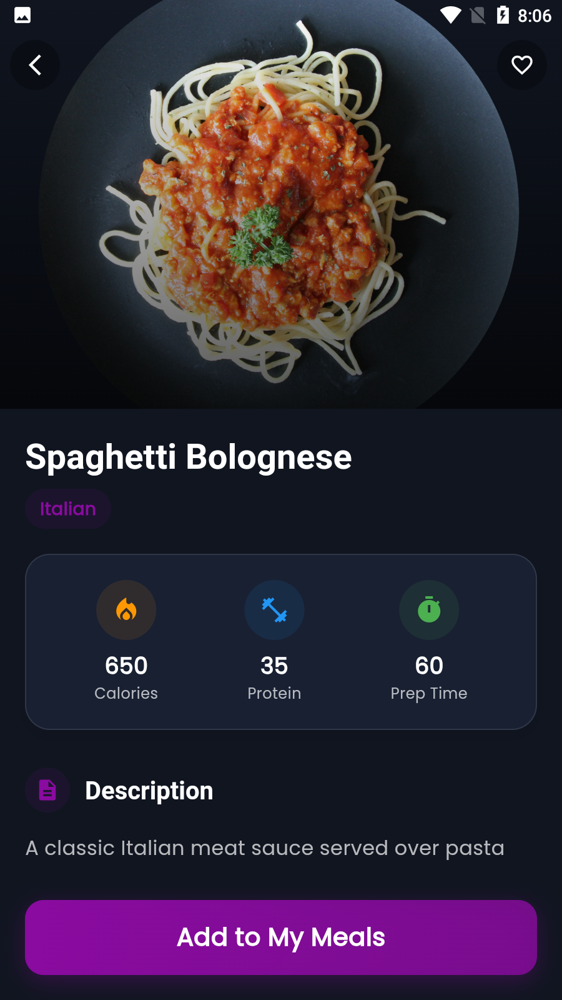
      <p><b>Recipe Details</b></p>
    </td>
    <td align="center">
      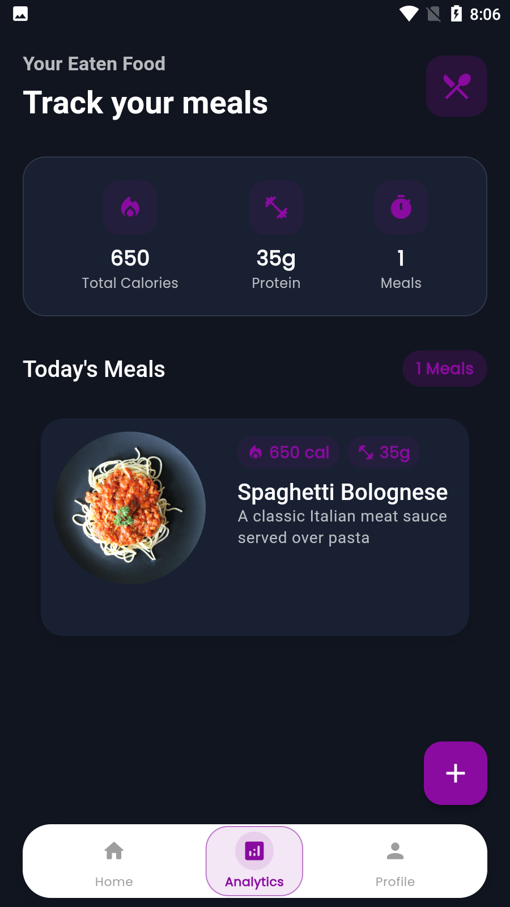
      <p><b>Analytics</b></p>
    </td>
    <td align="center">
      
      <p><b>BMI Calculator</b></p>
    </td>
  </tr>
</table>

### Profile & Settings

<table border="1">
  <tr>
    <td align="center">
      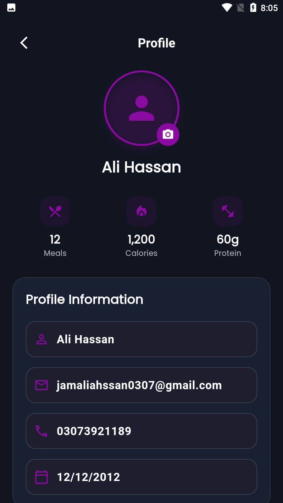
      <p><b>Profile Edit</b></p>
    </td>
    <td align="center">
      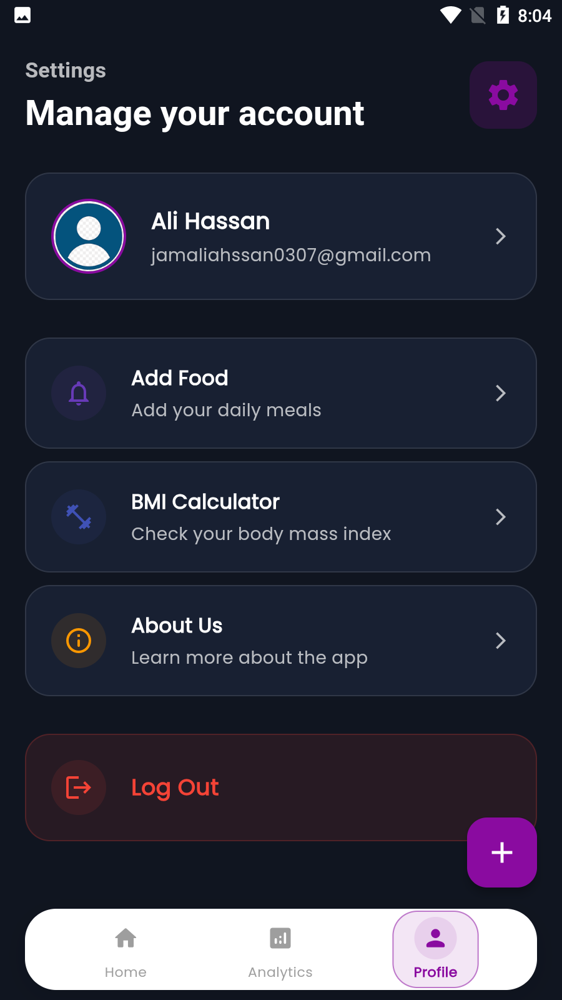
      <p><b>Settings</b></p>
    </td>
    <td align="center">
      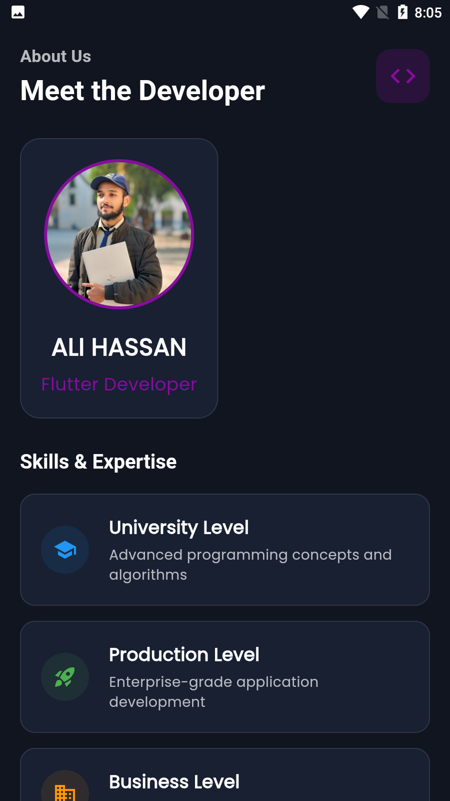
      <p><b>About Us</b></p>
    </td>
  </tr>
</table>

## 📱 Download APK

Download the latest version:
[APK/app-armeabi-v7a-release.apk](APK/app-armeabi-v7a-release.apk)

## 🚀 Tech Stack

- **Flutter** (UI Framework)
- **GetX** (State Management)
- **SQLite** (Local Database)
- **Shared Preferences** (Local Storage)
- **Material Design 3**
- **Custom Animations**

## 🔑 Key Features

- ✅ **Food Tracking**: Log your daily meals and snacks
- ✅ **Nutrition Analysis**: Track calories and nutrients
- ✅ **Recipe Management**: Save and organize your recipes
- ✅ **BMI Calculator**: Monitor your body mass index
- ✅ **Analytics Dashboard**: View your nutrition trends
- ✅ **Profile Management**: Customize your user profile
- ✅ **Beautiful UI**: Modern and intuitive interface
- ✅ **Offline Access**: Access your data without internet

## 📖 How to Use

1. **Track Your Meals**
   - Add food items to your diary
   - Log portion sizes
   - Track calories and nutrients

2. **Manage Recipes**
   - Save your favorite recipes
   - Add ingredients and instructions
   - Categorize by meal type

3. **Monitor Progress**
   - View daily nutrition summary
   - Track BMI changes
   - Analyze eating patterns

4. **Profile Settings**
   - Update personal information
   - Customize app preferences
   - Manage account settings

## Project Structure

```
lib/
├── screen/
│   ├── splash_screen.dart
│   ├── walkthrough_screen.dart
│   ├── login_screen.dart
│   ├── home_screen.dart
│   ├── recipe_details_screen.dart
│   ├── analytics_screen.dart
│   ├── profile_screen.dart
│   └── setting_screen.dart
├── model/
│   ├── recipe_model.dart
│   └── user_model.dart
├── controller/
│   ├── recipe_controller.dart
│   └── user_controller.dart
└── main.dart
```

## 📝 License

This project is licensed under the MIT License - see the LICENSE file for details.
